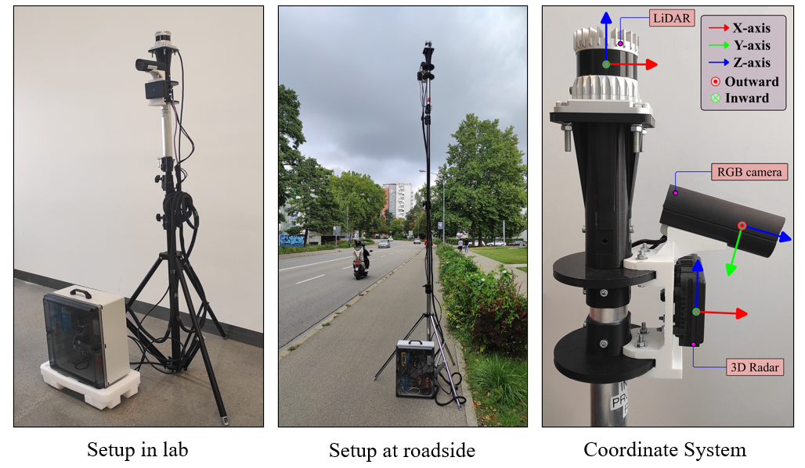

# INFRA-3DRC Dataset
This is the offical repository of [INFRA-3DRC Dataset](https://ieeexplore.ieee.org/document/10459049), a public dataset comparised of 3D automotive Radar and RGB camera data generated using Intelligent roadside Infrastructure (also known as smart Infrastructure) setup. It contains the links to download dataset, software development kit (SDK) to read and perform basic functions on the dataset, and related documentation.
<br/>
<br/>
This work is supported by the Bavarian Ministry of Economic Affairs, Regional Development and Energy (StMWi), Germany within the Project “InFra — Intelligent Infrastructure.” 
<br/>
<br/>
Disclaimer: In order to comply with European GDPR data privacy, the RGB camera images are annonymized to hide human faces and vehicle number plates in the camera images where this information was clearly visible. In other frames, where the information is self annonymized due to distance from camera, no annonymization is applied. For this purpose, the state-of-the-art algorithms known best to the knowledge of the developer are used.


## Overview
- [INFRA-3DRC Dataset](#infra-3drc-dataset)
  - [Overview](#overview)
  - [Introduction](#introduction)
  - [Smart Infrastructure sensors setup](#smart-infrastructure-sensors-setup)
  - [SDK User Guide](#sdk-user-guide)
  - [Dataset Format](#dataset-format)
  - [Dataset](#dataset)
  - [Annotation Format](#annotation-format)
  - [License](#license)
  - [Citation](#citation)
  - [Contact Us](#contact-us)

---

## Introduction
INFRA-3DRC Dataset is the public dataset generated using smart infrastructure setup. It consists of calibrated, time-synchronized, and annotated sensor frames of 3D autotmotive radar and RGB mono-camera. Each radar frame contains point-wise annotation and each camera image is annotated in form of 2D bounding box(es). For completeness, calibrated and time-synchronized 3D lidar sensor frames are also included in the dataset, but these frames are not annotated.  
<br />
Dataset consists of 25 scenes recorded from different geographical locations in different light conditions - day light, twilight and night. It contains total 2768 frames of each camera, radar, and lidar sensors. Camera annotations have 4172 instances and radar annotations have 4074 instances of total six object categories - adult, group, bicycle, motorcycle, car, and bus. It contains 22966 labeled points of radar data of valid traffic road users.   

Some examples of the dataset are shown below.  
<br/>

<p align="center">  </p>
<p align="center">  </p>
<p align="center">  </p>
<p align="center">  </p>

---

## Smart Infrastructure sensors setup
* The setup consists of 
  * RGB mono camera (ids CP-5260 rev 2 with 8 mm lens C-mount)
  * 3D Automotive radar (continental LRR ARS548) 
  * 3D-Lidar (Ouster OS1-64 channels),

* All the sensors are mounted on the extendable tripod for modular and flexible data collection.
* Below images are subject to copyright.

<p align="center">

</p>

---

## SDK User Guide
SDK as python package can be downloaded from [infra-3drc on pypi](https://pypi.org/project/infra-3drc/).  
The associated source code is hosted at [GITHUB-REPO](https://github.com/FraunhoferIVI/INFRA-3DRC-Dataset).  
SDK user guide with examples is available at [SDK-USER-GUIDE](docs/SDK_USER_GUIDE.md).

---

## Dataset Format
```---
  ├── INFRA-3DRC_scene-01
    ├── camera_01
      ├── camera_01__annotation - contains json files for each camera image
      ├── camera_01__data - contains png files of camera images
    ├── radar_01
      ├── radar_01__annotation - contains json files for each radar frame
      ├── radar_01__data - contains pcd files for each radar frame
    ├── lidar_01
      ├── lidar_01__data - contains pcd files for each lidar frame
    ├── calibration.json - contains extrinsic and intrinsic calibration matrix
    └── scene.json - contains meta-data of the scene

  ├── INFRA-3DRC_scene-02
    ├── camera_01
      ├── camera_01__annotation
      ├── camera_01__data
    ├── radar_01
      ├── radar_01__annotation
      ├── radar_01__data
    ├── lidar_01
      ├── lidar_01__data
    ├── calibration.json
    └── scene.json
.....

  ├── INFRA-3DRC_scene-NN
    ├── camera_01
      ├── camera_01__annotation
      ├── camera_01__data
    ├── radar_01
      ├── radar_01__annotation
      ├── radar_01__data
    ├── lidar_01
      ├── lidar_01__data
    ├── calibration.json
    └── scene.json
```

---

## Dataset

To download the dataset, refer the following page [DATASET-DOWNLOAD](docs/DOWNLOAD_DATASET.md)

---

## Annotation Format

Dataset contains annotations of 3D automotive radar sensor and RGB camera images. For details refer the following page [ANNOTATION-DETAILS](docs/ANNOTATION_DETAILS.md)

---

## License

* The dataset and the associated code is realeased under the CC BY-NC 4.0. [See here](https://creativecommons.org/licenses/by-nc/4.0/legalcode.en)
* Under this license, it is allowed to download and use only for research, teaching, and academic purpose only.
* Use of this dataset and associated code is prohibited to use for any commercial application.
* If in case, it is needed for commercial use, then kindly contact us (see bottom of this page). 

---

## Citation

```
@ARTICLE{10459049,
  author={Agrawal, Shiva and Bhanderi, Savankumar and Elger, Gordon},
  journal={IEEE Access}, 
  title={Semi-Automatic Annotation of 3D Radar and Camera for Smart Infrastructure-Based Perception}, 
  year={2024},
  volume={12},
  pages={34325-34341},
  doi={10.1109/ACCESS.2024.3373310}}

```

```
@misc{infra_3drc,
  author = {Shiva Agrawal and  Savankumar Bhanderi},
  title = {INFRA-3DRC dataset},
  version = {1.0.0},
  year = {2024},
  url = {https://github.com/FraunhoferIVI/INFRA-3DRC-Dataset},
  orcid = {0000-0001-8633-341X, 0000-0001-7257-6736},
  doi = {10.24406/fordatis/297},
  license = {CC BY-NC 4.0}
}
```

---

## Contact Us

Shiva Agrawal, <shiva.agrawal@thi.de>  
Savankumar Bhanderi, <savankumar.bhanderi@thi.de>  
